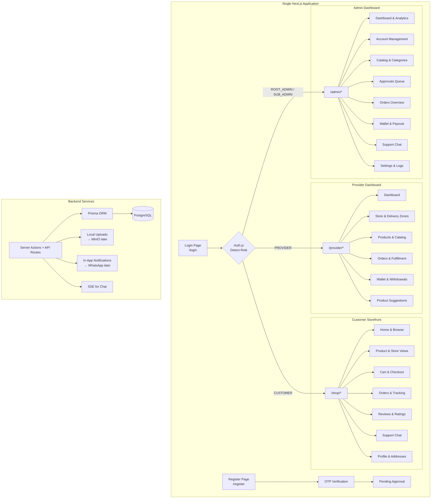
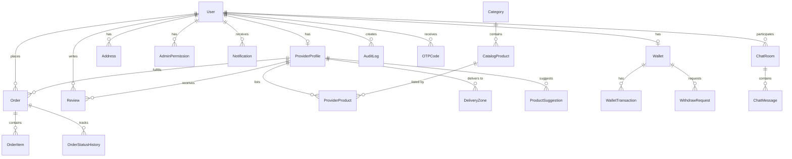

# Asshrabha — Bilingual Marketplace Platform (v2)

A full-stack, single-app marketplace platform where **Admins** manage the catalog, support, and platform operations, **Providers** list stock and prices against approved products and fulfill orders, and **Customers** purchase through a unified storefront. Fully bilingual (Arabic RTL / English LTR) with PWA support.

---

## Decisions Finalized

| Question | Decision |
|---|---|
| Database | PostgreSQL (local or cloud) |
| Image Storage | Local `uploads/` folder now → MinIO later |
| Payment Gateway | Manual via admin panel now → Custom API later |
| Notifications | In-app notifications now → WhatsApp API later |
| Order Flow | Pending → Confirmed → Shipped → Delivered/Completed (provider-managed) |
| Commission | Subscription fee per provider — **deferred to later phase** |
| Addresses | Customers: multiple saved addresses. Providers: selectable delivery zones |
| Products | Single SKU, bilingual, price range enforced, admin-controlled catalog |
| Reviews | Customers can rate/review products and providers |
| Support | In-app live chat (Customer ↔ Admin), visible in admin panel |
| Registration | Name, store name, location, mobile, password, location photo, OTP |
| OTP | In-app notification for now → WhatsApp API later |

---

## Technology Stack

| Layer | Technology | Version |
|---|---|---|
| Framework | Next.js (App Router) | 15.x |
| Language | TypeScript | 5.x |
| ORM | Prisma | 6.x |
| Database | PostgreSQL | 15+ |
| Authentication | Auth.js (NextAuth v5) | 5.x |
| Password Hashing | bcryptjs | 3.x |
| i18n | next-intl | 4.x |
| Styling | Vanilla CSS (CSS Modules + Custom Properties) | — |
| Icons | Lucide React | latest |
| Forms | React Hook Form + Zod | latest |
| State | Zustand | latest |
| PWA | @serwist/next | 9.x |
| Charts | Recharts | latest |
| File Upload | multer / formidable (local disk) | latest |
| Real-time Chat | Server-Sent Events (SSE) | native |

---

## Architecture Overview



---

## Complete Folder Structure

```
Asshrabha/
├── .env / .env.example
├── next.config.ts
├── tsconfig.json
├── package.json
├── uploads/                       # Local file storage (gitignored)
│   ├── products/
│   ├── stores/
│   ├── avatars/
│   └── locations/                 # Provider location photos
├── prisma/
│   ├── schema.prisma
│   ├── seed.ts
│   └── migrations/
├── public/
│   ├── manifest.json
│   ├── icons/
│   └── images/
├── messages/
│   ├── ar.json
│   └── en.json
├── src/
│   ├── middleware.ts               # Auth + i18n + role routing
│   ├── i18n/
│   │   ├── request.ts
│   │   └── routing.ts
│   ├── app/
│   │   ├── layout.tsx              # Root: i18n, fonts, dir, theme
│   │   ├── page.tsx                # Redirect → /login or /shop
│   │   ├── globals.css             # Design system
│   │   ├── login/page.tsx
│   │   ├── register/page.tsx       # Multi-step with OTP
│   │   ├── verify-otp/page.tsx     # OTP input screen
│   │   ├── pending/page.tsx        # "Awaiting Approval" page
│   │   ├── reset-password/page.tsx # Force password reset
│   │   │
│   │   ├── (admin)/
│   │   │   ├── layout.tsx
│   │   │   └── admin/
│   │   │       ├── page.tsx                    # Dashboard
│   │   │       ├── accounts/
│   │   │       │   ├── providers/page.tsx
│   │   │       │   ├── customers/page.tsx
│   │   │       │   └── admins/page.tsx
│   │   │       ├── categories/page.tsx
│   │   │       ├── catalog/
│   │   │       │   ├── page.tsx
│   │   │       │   └── [id]/page.tsx
│   │   │       ├── approvals/page.tsx
│   │   │       ├── orders/
│   │   │       │   ├── page.tsx
│   │   │       │   └── [id]/page.tsx
│   │   │       ├── wallet/
│   │   │       │   ├── page.tsx
│   │   │       │   └── requests/page.tsx
│   │   │       ├── support/
│   │   │       │   ├── page.tsx                # Chat list
│   │   │       │   └── [chatId]/page.tsx       # Chat thread
│   │   │       ├── analytics/page.tsx
│   │   │       ├── settings/page.tsx
│   │   │       └── logs/page.tsx
│   │   │
│   │   ├── (provider)/
│   │   │   ├── layout.tsx
│   │   │   └── provider/
│   │   │       ├── page.tsx                    # Dashboard
│   │   │       ├── store/page.tsx              # Store + delivery zones
│   │   │       ├── products/
│   │   │       │   ├── page.tsx                # My products
│   │   │       │   └── catalog/page.tsx        # Browse & add
│   │   │       ├── orders/
│   │   │       │   ├── page.tsx
│   │   │       │   └── [id]/page.tsx
│   │   │       ├── wallet/page.tsx
│   │   │       └── suggestions/page.tsx
│   │   │
│   │   ├── (shop)/
│   │   │   ├── layout.tsx
│   │   │   └── shop/
│   │   │       ├── page.tsx                    # Home
│   │   │       ├── category/[slug]/page.tsx
│   │   │       ├── product/[id]/page.tsx
│   │   │       ├── store/[id]/page.tsx
│   │   │       ├── cart/page.tsx
│   │   │       ├── checkout/page.tsx
│   │   │       ├── orders/
│   │   │       │   ├── page.tsx
│   │   │       │   └── [id]/page.tsx
│   │   │       ├── support/page.tsx            # Chat with support
│   │   │       └── profile/
│   │   │           ├── page.tsx
│   │   │           └── addresses/page.tsx
│   │   │
│   │   └── api/
│   │       ├── auth/[...nextauth]/route.ts
│   │       ├── upload/route.ts
│   │       ├── notifications/
│   │       │   └── stream/route.ts             # SSE endpoint
│   │       └── chat/
│   │           └── stream/route.ts             # SSE chat endpoint
│   │
│   ├── components/
│   │   ├── ui/                     # Design system primitives
│   │   │   ├── Button/
│   │   │   ├── Input/
│   │   │   ├── Select/
│   │   │   ├── Modal/
│   │   │   ├── Table/
│   │   │   ├── Card/
│   │   │   ├── Badge/
│   │   │   ├── Tabs/
│   │   │   ├── Toast/
│   │   │   ├── Skeleton/
│   │   │   ├── Avatar/
│   │   │   ├── DropdownMenu/
│   │   │   ├── FileUpload/
│   │   │   ├── StarRating/
│   │   │   ├── OTPInput/
│   │   │   └── ChatBubble/
│   │   ├── layout/
│   │   │   ├── AdminSidebar.tsx
│   │   │   ├── ProviderSidebar.tsx
│   │   │   ├── ShopHeader.tsx
│   │   │   ├── ShopBottomNav.tsx
│   │   │   ├── NotificationBell.tsx
│   │   │   ├── NotificationPanel.tsx
│   │   │   ├── LanguageSwitcher.tsx
│   │   │   └── ThemeToggle.tsx
│   │   ├── forms/
│   │   │   ├── LoginForm.tsx
│   │   │   ├── RegisterForm.tsx
│   │   │   ├── ProductForm.tsx
│   │   │   ├── StoreProfileForm.tsx
│   │   │   ├── AddressForm.tsx
│   │   │   └── ReviewForm.tsx
│   │   ├── chat/
│   │   │   ├── ChatWindow.tsx
│   │   │   ├── ChatMessage.tsx
│   │   │   ├── ChatList.tsx
│   │   │   └── ChatInput.tsx
│   │   ├── notifications/
│   │   │   ├── NotificationProvider.tsx
│   │   │   └── NotificationItem.tsx
│   │   ├── admin/
│   │   ├── provider/
│   │   └── shop/
│   │
│   ├── lib/
│   │   ├── auth.ts
│   │   ├── prisma.ts
│   │   ├── upload.ts               # File upload handler (local → MinIO ready)
│   │   ├── notifications.ts        # In-app notification service
│   │   ├── otp.ts                  # OTP generation & verification
│   │   ├── validations/
│   │   │   ├── auth.ts
│   │   │   ├── product.ts
│   │   │   ├── category.ts
│   │   │   ├── wallet.ts
│   │   │   ├── address.ts
│   │   │   └── review.ts
│   │   ├── actions/
│   │   │   ├── auth.actions.ts
│   │   │   ├── admin.actions.ts
│   │   │   ├── provider.actions.ts
│   │   │   ├── shop.actions.ts
│   │   │   ├── wallet.actions.ts
│   │   │   ├── chat.actions.ts
│   │   │   ├── notification.actions.ts
│   │   │   └── review.actions.ts
│   │   └── utils/
│   │       ├── helpers.ts
│   │       ├── constants.ts
│   │       └── permissions.ts
│   │
│   ├── hooks/
│   │   ├── useCart.ts
│   │   ├── useAuth.ts
│   │   ├── useNotifications.ts     # SSE hook for real-time notifications
│   │   ├── useChat.ts              # SSE hook for real-time chat
│   │   └── useDebounce.ts
│   │
│   ├── stores/
│   │   ├── cartStore.ts
│   │   ├── notificationStore.ts
│   │   └── uiStore.ts
│   │
│   └── types/
│       └── index.ts
```

---

## Complete Database Schema



### Prisma Schema (Complete)

```prisma
generator client {
  provider = "prisma-client-js"
}

datasource db {
  provider = "postgresql"
  url      = env("DATABASE_URL")
}

// ═══════════════════════════════════════
// ENUMS
// ═══════════════════════════════════════

enum UserRole {
  ROOT_ADMIN
  SUB_ADMIN
  PROVIDER
  CUSTOMER
}

enum AccountStatus {
  PENDING
  APPROVED
  REJECTED
  SUSPENDED
  DISABLED
}

enum ProductStatus {
  DRAFT
  ACTIVE
  INACTIVE
  ARCHIVED
}

enum ProviderProductStatus {
  PENDING_APPROVAL
  APPROVED
  REJECTED
  SUSPENDED
}

enum SuggestionStatus {
  PENDING
  APPROVED
  REJECTED
  MERGED
}

enum OrderStatus {
  PENDING
  CONFIRMED
  SHIPPED
  DELIVERED
  COMPLETED
  CANCELLED
  REFUNDED
}

enum WalletTxType {
  ORDER_CREDIT
  WITHDRAWAL
  REFUND
  ADJUSTMENT
  PLATFORM_FEE
}

enum WalletTxStatus {
  PENDING
  COMPLETED
  FAILED
  REVERSED
}

enum WithdrawStatus {
  PENDING
  APPROVED
  REJECTED
  PROCESSING
  COMPLETED
  FROZEN
}

enum NotificationType {
  ACCOUNT_APPROVED
  ACCOUNT_REJECTED
  ORDER_PLACED
  ORDER_STATUS_CHANGED
  PRODUCT_APPROVED
  PRODUCT_REJECTED
  PRICE_CHANGE_APPROVED
  WITHDRAWAL_APPROVED
  WITHDRAWAL_REJECTED
  NEW_CHAT_MESSAGE
  SUGGESTION_STATUS
  OTP_CODE
  SYSTEM
}

enum AdminPermissionType {
  MANAGE_PROVIDERS
  MANAGE_CUSTOMERS
  MANAGE_CATALOG
  MANAGE_CATEGORIES
  MANAGE_ORDERS
  MANAGE_WALLETS
  MANAGE_SETTINGS
  MANAGE_SUPPORT
  VIEW_ANALYTICS
  MANAGE_APPROVALS
  VIEW_LOGS
}

// ═══════════════════════════════════════
// CORE MODELS
// ═══════════════════════════════════════

model User {
  id                 String            @id @default(cuid())
  mobile             String            @unique
  email              String?
  passwordHash       String
  nameAR             String?
  nameEN             String?
  avatar             String?
  role               UserRole
  status             AccountStatus     @default(PENDING)
  forcePasswordReset Boolean           @default(false)
  locale             String            @default("ar")
  lastLoginAt        DateTime?
  createdAt          DateTime          @default(now())
  updatedAt          DateTime          @updatedAt

  providerProfile    ProviderProfile?
  wallet             Wallet?
  permissions        AdminPermission[]
  customerOrders     Order[]           @relation("CustomerOrders")
  addresses          Address[]
  reviews            Review[]
  notifications      Notification[]
  chatRooms          ChatParticipant[]
  chatMessages       ChatMessage[]
  otpCodes           OTPCode[]
  auditLogs          AuditLog[]

  @@index([role, status])
  @@index([mobile])
}

model AdminPermission {
  id         String              @id @default(cuid())
  userId     String
  permission AdminPermissionType
  user       User                @relation(fields: [userId], references: [id], onDelete: Cascade)

  @@unique([userId, permission])
}

model OTPCode {
  id        String   @id @default(cuid())
  userId    String
  code      String
  expiresAt DateTime
  verified  Boolean  @default(false)
  createdAt DateTime @default(now())
  user      User     @relation(fields: [userId], references: [id], onDelete: Cascade)

  @@index([userId, code])
}

// ═══════════════════════════════════════
// PROVIDER MODELS
// ═══════════════════════════════════════

model ProviderProfile {
  id             String   @id @default(cuid())
  userId         String   @unique
  shopNameAR     String
  shopNameEN     String
  descriptionAR  String?
  descriptionEN  String?
  logo           String?
  banner         String?
  locationPhoto  String?           // Photo of physical location
  locationLat    Float?
  locationLng    Float?
  locationAddress String?
  rating         Float             @default(0)
  reviewCount    Int               @default(0)
  isVisible      Boolean           @default(false)
  createdAt      DateTime          @default(now())
  updatedAt      DateTime          @updatedAt

  user           User              @relation(fields: [userId], references: [id], onDelete: Cascade)
  products       ProviderProduct[]
  deliveryZones  DeliveryZone[]
  orders         Order[]           @relation("ProviderOrders")
  suggestions    ProductSuggestion[]
  reviews        Review[]

  @@index([isVisible])
}

model DeliveryZone {
  id         String          @id @default(cuid())
  providerId String
  nameAR     String
  nameEN     String
  isActive   Boolean         @default(true)
  provider   ProviderProfile @relation(fields: [providerId], references: [id], onDelete: Cascade)

  @@index([providerId])
}

// ═══════════════════════════════════════
// CATALOG MODELS
// ═══════════════════════════════════════

model Category {
  id        String           @id @default(cuid())
  nameAR    String
  nameEN    String
  slug      String           @unique
  icon      String?
  image     String?
  sortOrder Int              @default(0)
  isActive  Boolean          @default(true)
  createdAt DateTime         @default(now())
  updatedAt DateTime         @updatedAt
  products  CatalogProduct[]
}

model CatalogProduct {
  id              String              @id @default(cuid())
  categoryId      String
  nameAR          String
  nameEN          String
  descriptionAR   String?
  descriptionEN   String?
  images          String[]            // Array of image paths
  minimumPrice    Float
  maximumPrice    Float
  status          ProductStatus       @default(ACTIVE)
  createdAt       DateTime            @default(now())
  updatedAt       DateTime            @updatedAt

  category        Category            @relation(fields: [categoryId], references: [id])
  providerProducts ProviderProduct[]

  @@index([categoryId, status])
  @@index([status])
}

model ProviderProduct {
  id               String                @id @default(cuid())
  providerId       String
  catalogProductId String
  sellingPrice     Float
  stockQuantity    Int                   @default(0)
  status           ProviderProductStatus @default(PENDING_APPROVAL)
  priceApproved    Boolean               @default(false)
  createdAt        DateTime              @default(now())
  updatedAt        DateTime              @updatedAt

  provider         ProviderProfile       @relation(fields: [providerId], references: [id], onDelete: Cascade)
  catalogProduct   CatalogProduct        @relation(fields: [catalogProductId], references: [id])
  orderItems       OrderItem[]

  @@unique([providerId, catalogProductId])
  @@index([providerId, status])
  @@index([catalogProductId])
}

model ProductSuggestion {
  id                 String           @id @default(cuid())
  providerId         String
  nameAR             String
  nameEN             String
  descriptionAR      String?
  descriptionEN      String?
  images             String[]
  categorySuggestion String?
  status             SuggestionStatus @default(PENDING)
  adminNote          String?
  createdAt          DateTime         @default(now())
  updatedAt          DateTime         @updatedAt

  provider           ProviderProfile  @relation(fields: [providerId], references: [id], onDelete: Cascade)

  @@index([status])
}

// ═══════════════════════════════════════
// ORDER MODELS
// ═══════════════════════════════════════

model Address {
  id          String   @id @default(cuid())
  userId      String
  label       String               // "Home", "Work", etc.
  fullName    String
  mobile      String
  addressLine String
  city        String
  area        String?
  landmark    String?
  lat         Float?
  lng         Float?
  isDefault   Boolean  @default(false)
  createdAt   DateTime @default(now())
  updatedAt   DateTime @updatedAt

  user        User     @relation(fields: [userId], references: [id], onDelete: Cascade)
  orders      Order[]

  @@index([userId])
}

model Order {
  id              String             @id @default(cuid())
  orderNumber     String             @unique     // Human-readable: ASH-20260615-001
  customerId      String
  providerId      String
  addressId       String?
  totalAmount     Float
  platformFee     Float              @default(0)
  status          OrderStatus        @default(PENDING)
  customerNote    String?
  trackingNumber  String?
  createdAt       DateTime           @default(now())
  updatedAt       DateTime           @updatedAt

  customer        User               @relation("CustomerOrders", fields: [customerId], references: [id])
  provider        ProviderProfile    @relation("ProviderOrders", fields: [providerId], references: [id])
  address         Address?           @relation(fields: [addressId], references: [id])
  items           OrderItem[]
  statusHistory   OrderStatusHistory[]

  @@index([customerId])
  @@index([providerId])
  @@index([status])
  @@index([orderNumber])
}

model OrderItem {
  id                String          @id @default(cuid())
  orderId           String
  providerProductId String
  quantity          Int
  unitPrice         Float
  totalPrice        Float

  order             Order           @relation(fields: [orderId], references: [id], onDelete: Cascade)
  providerProduct   ProviderProduct @relation(fields: [providerProductId], references: [id])

  @@index([orderId])
}

model OrderStatusHistory {
  id        String      @id @default(cuid())
  orderId   String
  status    OrderStatus
  note      String?
  changedBy String?             // userId who changed
  createdAt DateTime    @default(now())

  order     Order       @relation(fields: [orderId], references: [id], onDelete: Cascade)

  @@index([orderId])
}

// ═══════════════════════════════════════
// WALLET MODELS
// ═══════════════════════════════════════

model Wallet {
  id               String             @id @default(cuid())
  userId           String             @unique
  pendingBalance   Float              @default(0)
  availableBalance Float              @default(0)
  totalPaid        Float              @default(0)
  isFrozen         Boolean            @default(false)
  createdAt        DateTime           @default(now())
  updatedAt        DateTime           @updatedAt

  user             User               @relation(fields: [userId], references: [id], onDelete: Cascade)
  transactions     WalletTransaction[]
  withdrawRequests WithdrawRequest[]
}

model WalletTransaction {
  id        String       @id @default(cuid())
  walletId  String
  amount    Float
  type      WalletTxType
  status    WalletTxStatus @default(PENDING)
  reference String?              // e.g., Order ID
  note      String?
  createdAt DateTime     @default(now())

  wallet    Wallet       @relation(fields: [walletId], references: [id], onDelete: Cascade)

  @@index([walletId, type])
}

model WithdrawRequest {
  id         String         @id @default(cuid())
  walletId   String
  amount     Float
  status     WithdrawStatus @default(PENDING)
  adminNote  String?
  processedBy String?              // Admin userId
  createdAt  DateTime       @default(now())
  updatedAt  DateTime       @updatedAt

  wallet     Wallet         @relation(fields: [walletId], references: [id], onDelete: Cascade)

  @@index([walletId, status])
}

// ═══════════════════════════════════════
// REVIEW MODELS
// ═══════════════════════════════════════

model Review {
  id              String          @id @default(cuid())
  userId          String
  providerId      String?
  catalogProductId String?
  rating          Int                 // 1-5
  comment         String?
  isVisible       Boolean         @default(true)
  createdAt       DateTime        @default(now())
  updatedAt       DateTime        @updatedAt

  user            User            @relation(fields: [userId], references: [id], onDelete: Cascade)
  provider        ProviderProfile? @relation(fields: [providerId], references: [id])

  @@index([providerId])
  @@index([catalogProductId])
}

// ═══════════════════════════════════════
// CHAT / SUPPORT MODELS
// ═══════════════════════════════════════

model ChatRoom {
  id           String            @id @default(cuid())
  subject      String?
  isClosed     Boolean           @default(false)
  createdAt    DateTime          @default(now())
  updatedAt    DateTime          @updatedAt

  participants ChatParticipant[]
  messages     ChatMessage[]

  @@index([isClosed, updatedAt])
}

model ChatParticipant {
  id         String   @id @default(cuid())
  chatRoomId String
  userId     String
  joinedAt   DateTime @default(now())
  lastReadAt DateTime?

  chatRoom   ChatRoom @relation(fields: [chatRoomId], references: [id], onDelete: Cascade)
  user       User     @relation(fields: [userId], references: [id], onDelete: Cascade)

  @@unique([chatRoomId, userId])
}

model ChatMessage {
  id         String   @id @default(cuid())
  chatRoomId String
  senderId   String
  content    String
  isRead     Boolean  @default(false)
  createdAt  DateTime @default(now())

  chatRoom   ChatRoom @relation(fields: [chatRoomId], references: [id], onDelete: Cascade)
  sender     User     @relation(fields: [senderId], references: [id])

  @@index([chatRoomId, createdAt])
}

// ═══════════════════════════════════════
// NOTIFICATION MODELS
// ═══════════════════════════════════════

model Notification {
  id        String           @id @default(cuid())
  userId    String
  type      NotificationType
  titleAR   String
  titleEN   String
  bodyAR    String?
  bodyEN    String?
  data      Json?                   // Additional payload
  isRead    Boolean          @default(false)
  createdAt DateTime         @default(now())

  user      User             @relation(fields: [userId], references: [id], onDelete: Cascade)

  @@index([userId, isRead, createdAt])
}

// ═══════════════════════════════════════
// SYSTEM MODELS
// ═══════════════════════════════════════

model SystemSetting {
  key         String   @id
  value       String
  description String?
  updatedAt   DateTime @updatedAt
}

model AuditLog {
  id        String   @id @default(cuid())
  userId    String?
  action    String
  entity    String
  entityId  String?
  details   Json?
  ipAddress String?
  createdAt DateTime @default(now())

  user      User?    @relation(fields: [userId], references: [id])

  @@index([entity, entityId])
  @@index([userId, createdAt])
  @@index([createdAt])
}
```

---

## Proposed Changes by Phase

### Phase 1: Project Initialization & Design System

#### [NEW] Project scaffold via `npx create-next-app@latest ./`
- Next.js 15, TypeScript, App Router, no Tailwind (vanilla CSS)
- Install: `prisma`, `@prisma/client`, `next-intl`, `@auth/prisma-adapter`, `next-auth`, `bcryptjs`, `zod`, `react-hook-form`, `@hookform/resolvers`, `zustand`, `lucide-react`, `recharts`, `@serwist/next`

#### [NEW] `src/app/globals.css` — Premium Design System
- **Color System**: Deep indigo primary (`hsl(245, 58%, 51%)`), violet secondary, emerald success, amber warning, rose error — with full dark mode palette
- **Typography**: Inter (Latin) + Noto Kufi Arabic (Arabic) from Google Fonts; modular type scale
- **Spacing/Sizing**: 4px grid system, fluid typography with `clamp()`
- **Effects**: Glassmorphism cards (`backdrop-filter: blur`), gradient overlays, soft shadows with colored tints
- **Animations**: `@keyframes` for fade-in, slide-up, slide-in-left/right, scale, shimmer (skeleton), pulse (notifications)
- **RTL Utilities**: CSS logical properties (`margin-inline-start`, `padding-inline-end`), `[dir="rtl"]` overrides
- **Component Tokens**: Button variants, input states, card styles, badge colors, table stripes
- **Responsive**: Mobile-first breakpoints at 480px, 768px, 1024px, 1280px

#### [NEW] `src/components/ui/*.tsx` — 16 Core Components
Each with CSS Module + TypeScript:
| Component | Features |
|---|---|
| Button | Variants (primary/secondary/ghost/danger), sizes, loading state, icon support |
| Input | Label, error, helper text, RTL-aware, password toggle |
| Select | Searchable, multi-select, grouped options |
| Modal | Animated overlay, sizes, close on ESC/backdrop |
| Table | Sortable columns, pagination, responsive (cards on mobile), empty state |
| Card | Glassmorphism variant, hover lift, clickable |
| Badge | Status colors, dot indicator, removable |
| Tabs | Animated indicator, vertical/horizontal |
| Toast | Success/error/warning/info, auto-dismiss, stack |
| Skeleton | Shimmer animation, various shapes |
| Avatar | Image/initials fallback, sizes, online indicator |
| DropdownMenu | Animated, keyboard nav, nested menus |
| FileUpload | Drag & drop, preview, multi-file, progress |
| StarRating | Interactive + display mode, half stars |
| OTPInput | 4-6 digit, auto-focus next, paste support |
| ChatBubble | Sent/received variants, timestamp, read status |

---

### Phase 2: Database & Prisma Setup

#### [NEW] `prisma/schema.prisma`
- Complete schema as documented above (20 models, 12 enums)

#### [NEW] `prisma/seed.ts`
```
ROOT_ADMIN:
  mobile: "01094056919"
  password: bcrypt("2463")
  role: ROOT_ADMIN
  status: ACTIVE
  forcePasswordReset: true
  nameAR: "مدير النظام"
  nameEN: "System Admin"

+ Create Wallet for admin

CATEGORIES (6):
  Electronics / إلكترونيات (slug: electronics)
  Fashion / أزياء (slug: fashion)
  Beauty / جمال (slug: beauty)
  Home / منزل (slug: home)
  Sports / رياضة (slug: sports)
  Food / طعام (slug: food)

SYSTEM SETTINGS:
  requireProviderApproval = "true"
  requireCustomerApproval = "true"
  allowProviderRegistration = "true"
  allowCustomerRegistration = "true"
  defaultLocale = "ar"
  supportedLocales = "ar,en"
  platformCommission = "0"
  requirePriceApproval = "true"
```

#### [NEW] `src/lib/prisma.ts`
- Singleton pattern for Prisma client (dev hot-reload safe)

---

### Phase 3: Authentication & Routing

#### [NEW] `src/lib/auth.ts` — Auth.js v5 Config
- Credentials provider: validate mobile + password via bcrypt
- Check account status (reject PENDING/SUSPENDED/DISABLED)
- Session callback: inject `id`, `role`, `status`, `forcePasswordReset`, `locale`
- JWT strategy

#### [NEW] `src/middleware.ts` — Multi-layer Middleware
```
Request
  → next-intl locale detection
  → Auth check (public routes whitelist: /login, /register, /verify-otp)
  → Status check:
      PENDING → redirect /pending
      SUSPENDED/DISABLED → redirect /login?error=suspended
  → forcePasswordReset → redirect /reset-password
  → Role routing guard:
      /admin/* → ROOT_ADMIN | SUB_ADMIN (+ permission check)
      /provider/* → PROVIDER + APPROVED
      /shop/* → CUSTOMER + APPROVED (or public browse)
```

#### [NEW] `src/lib/otp.ts` — OTP Service
- Generate 6-digit code
- Store in OTPCode table with 5-min expiry
- Verify code
- Currently: creates in-app notification with code
- Later: sends via WhatsApp API

#### [NEW] Auth Pages:
| Page | Features |
|---|---|
| `/login` | Glassmorphism card, gradient bg, mobile+password, language switcher, animated |
| `/register` | Multi-step: (1) Choose role → (2) Details → (3) OTP. Provider fields: name, store name, mobile, password, location, location photo |
| `/verify-otp` | 6-digit OTP input, countdown timer, resend button |
| `/pending` | Animated waiting page with status check polling |
| `/reset-password` | Force new password for seed admin |

---

### Phase 4: i18n (Arabic + English)

#### [NEW] `messages/ar.json` & `messages/en.json`
- ~500+ translation keys organized by namespace
- Namespaces: `common`, `auth`, `admin`, `provider`, `shop`, `validation`, `notifications`, `chat`, `errors`

#### [NEW] `src/i18n/request.ts` & `routing.ts`
- Cookie-based locale persistence (`NEXT_LOCALE`)
- `getRequestConfig` for server components
- Client-side `useTranslations` hook

#### [NEW] `src/app/layout.tsx`
- `<html lang={locale} dir={locale === 'ar' ? 'rtl' : 'ltr'}>`
- Google Fonts loader
- Global providers: Auth, i18n, Toast, Notification
- PWA meta tags

#### [NEW] `src/components/layout/LanguageSwitcher.tsx`
- Toggle AR ↔ EN
- Updates cookie + reloads with new locale
- Animated flag/label transition

---

### Phase 5: Admin Dashboard (14 pages)

#### [NEW] `src/components/layout/AdminSidebar.tsx`
- Collapsible sidebar (icon-only when collapsed)
- Position: RIGHT when `dir="rtl"`, LEFT when `dir="ltr"` (CSS logical properties)
- Mobile: full overlay drawer with backdrop
- Sections with collapsible groups
- Active route highlighting with animated indicator
- User avatar + role badge at bottom
- Permission-based menu item visibility (SUB_ADMIN sees only permitted sections)

#### [NEW] Admin Pages:

| Page | Key Features |
|---|---|
| **Dashboard** `/admin` | KPI cards (total revenue, orders today, active providers, pending approvals) with animated counters. Revenue chart (Recharts), recent orders table, recent activity feed |
| **Providers** `/admin/accounts/providers` | Filterable table (status, search). Actions: Approve, Reject, Suspend, View profile + location photo. Expandable row with store details |
| **Customers** `/admin/accounts/customers` | Same pattern as providers. Actions: Approve, Reject, Suspend, Disable |
| **Admins** `/admin/accounts/admins` | ROOT only. Create sub-admin with permission checkboxes. Table of existing admins |
| **Categories** `/admin/categories` | Card grid with drag-to-reorder. Create/Edit modal with AR/EN names, icon upload, status toggle |
| **Catalog** `/admin/catalog` | Product grid/list toggle. Create: name AR/EN, description AR/EN, images (multi-upload), category select, min/max price. Edit inline |
| **Catalog Detail** `/admin/catalog/[id]` | Full product editor. See which providers list it, their prices. Approve/reject price changes |
| **Approvals** `/admin/approvals` | Tabbed: Account Approvals, Product Listings, Price Changes, Product Suggestions. Each tab has approve/reject with note |
| **Orders** `/admin/orders` | All platform orders. Filters: status, provider, date range, customer. Click → order detail |
| **Order Detail** `/admin/orders/[id]` | Full order timeline, items, customer info, provider info, status history |
| **Wallet Overview** `/admin/wallet` | Platform total, provider balances table, recent transactions |
| **Payout Requests** `/admin/wallet/requests` | Withdrawal requests: Approve, Reject (with note), Freeze wallet. Status filters |
| **Support Chat** `/admin/support` | Chat list: customer name, mobile, last message, unread count. Real-time via SSE |
| **Support Thread** `/admin/support/[chatId]` | Full chat thread, customer info sidebar, mark resolved, send messages |
| **Analytics** `/admin/analytics` | Revenue over time, orders over time, top products, top providers, new registrations, category breakdown (all Recharts) |
| **Settings** `/admin/settings` | Toggle switches: provider/customer registration, approval requirements, price approval. Platform name, default locale |
| **Logs** `/admin/logs` | Audit log table with filters: user, action, entity, date range. Expandable detail JSON |

---

### Phase 6: Provider Dashboard (8 pages)

#### [NEW] `src/components/layout/ProviderSidebar.tsx`
- Same RTL/LTR behavior as admin
- Sections: Dashboard, Store, Products, Orders, Wallet, Suggestions

#### [NEW] Provider Pages:

| Page | Key Features |
|---|---|
| **Dashboard** `/provider` | Revenue today/week/month cards, pending orders count, low stock alerts, wallet balance, recent orders |
| **Store Profile** `/provider/store` | Edit: shop name AR/EN, description AR/EN, logo upload, banner upload, location photo. **Delivery Zones**: add/remove zones with AR/EN names |
| **Browse Catalog** `/provider/products/catalog` | Admin catalog browser. Category filter. For each product: see allowed price range, enter selling price + stock quantity → Submit. Validation: `price >= min && price <= max && stock >= 0` |
| **My Products** `/provider/products` | Listed products grid. Edit price (triggers re-approval if `requirePriceApproval`), edit stock (instant). Status badges. Remove listing |
| **Orders** `/provider/orders` | Incoming orders table. Status filters. Actions: Confirm → Ship (add tracking) → Mark Delivered |
| **Order Detail** `/provider/orders/[id]` | Order items, customer address, status timeline, update status with note |
| **Wallet** `/provider/wallet` | Available/Pending/Total balances. Transaction history. Request Withdrawal button → modal with amount input |
| **Suggestions** `/provider/suggestions` | Suggest new product: name AR/EN, description AR/EN, images, category suggestion. See status of past suggestions |

---

### Phase 7: Customer Storefront (10 pages)

#### [NEW] `src/components/layout/ShopHeader.tsx`
- Logo, search bar, cart badge, notifications, language switcher, profile dropdown
- Sticky on scroll with backdrop blur

#### [NEW] `src/components/layout/ShopBottomNav.tsx`
- Mobile only (hidden on desktop)
- 5 tabs: Home, Categories, Cart (with count badge), Orders, Profile
- Active tab indicator with micro-animation

#### [NEW] Customer Pages:

| Page | Key Features |
|---|---|
| **Home** `/shop` | Hero carousel/banner, featured categories (horizontal scroll), trending products grid, top-rated stores |
| **Category** `/shop/category/[slug]` | Product grid. Filters: price range, provider, availability. Sort: price, newest, rating |
| **Product** `/shop/product/[id]` | Image gallery with zoom, provider info card (click → store), price, stock status, add to cart (quantity selector), reviews section, related products |
| **Store** `/shop/store/[id]` | Provider banner, info, rating, delivery zones, all products by this provider |
| **Cart** `/shop/cart` | Items grouped by provider. Quantity +/−. Remove item (swipe on mobile). Per-provider subtotal + grand total. Proceed to checkout |
| **Checkout** `/shop/checkout` | Select saved address or add new. Order summary per provider. Place order (creates 1 order per provider). Success confirmation |
| **Orders** `/shop/orders` | Order cards with status badge, order number, date, total. Filter by status |
| **Order Detail** `/shop/orders/[id]` | Visual status timeline (Pending → Confirmed → Shipped → Delivered), items list, tracking number, provider info, leave review (after delivery) |
| **Support** `/shop/support` | Chat with admin support. Send message, see history. Real-time via SSE |
| **Profile** `/shop/profile` | Edit name, mobile, avatar. Change password |
| **Addresses** `/shop/profile/addresses` | List saved addresses, add new, edit, set default, delete. Address form: label, full name, mobile, address line, city, area, landmark |

---

### Phase 8: Server Actions & Business Logic

#### [NEW] `src/lib/actions/auth.actions.ts`
- `loginAction(mobile, password)`: validate → check status → return session
- `registerAction(data)`: create user (PENDING) → create OTP → return
- `verifyOTPAction(userId, code)`: verify → update status if `requireApproval=false`
- `changePasswordAction(userId, oldPw, newPw)`: validate → hash → update → clear `forcePasswordReset`
- `resendOTPAction(userId)`: generate new code → create notification

#### [NEW] `src/lib/actions/admin.actions.ts`
- Account management: approve/reject/suspend/disable + send notification
- Category CRUD with slug generation
- Catalog product CRUD with image upload
- Approval actions: approve/reject provider products, price changes, suggestions
- Create sub-admin with permissions
- Update system settings
- Manual payment recording (mark withdrawal as paid)

#### [NEW] `src/lib/actions/provider.actions.ts`
- List product from catalog (with price/stock validation)
- Update price (triggers approval flow if setting enabled)
- Update stock (instant)
- Update store profile + delivery zones
- Submit product suggestion
- Update order status (Confirm/Ship/Deliver)

#### [NEW] `src/lib/actions/shop.actions.ts`
- Browse products (with filters, pagination, search)
- Browse categories
- Place order (transaction: create order + items + deduct stock)
- View order history + details
- Submit review

#### [NEW] `src/lib/actions/wallet.actions.ts`
- Credit provider wallet on order delivery
- Request withdrawal
- Admin: approve/reject/freeze withdrawal
- Get balance and transaction history

#### [NEW] `src/lib/actions/chat.actions.ts`
- Create chat room (customer → admin)
- Send message
- Get chat history
- Mark messages as read
- Close chat room

#### [NEW] `src/lib/actions/notification.actions.ts`
- Create notification (with AR+EN titles)
- Get user notifications
- Mark as read / mark all read
- SSE stream endpoint for real-time delivery

#### [NEW] `src/lib/actions/review.actions.ts`
- Submit review (rating + comment)
- Get reviews for product/provider
- Update provider rating aggregate

---

### Phase 9: Real-time Features

#### [NEW] `src/api/notifications/stream/route.ts`
- SSE endpoint: long-lived connection per authenticated user
- Polls for new notifications every 3 seconds
- Sends notification objects as JSON events

#### [NEW] `src/api/chat/stream/route.ts`
- SSE endpoint for chat rooms
- Real-time message delivery
- Typing indicator support

#### [NEW] `src/hooks/useNotifications.ts`
- Connects to SSE stream on mount
- Updates Zustand notification store
- Shows toast for new notifications
- Reconnects on disconnect

#### [NEW] `src/hooks/useChat.ts`
- Connects to chat SSE stream
- Real-time message updates
- Scroll to bottom on new message

---

### Phase 10: File Upload System

#### [NEW] `src/lib/upload.ts`
- Abstracted upload service (local disk now, MinIO interface later)
- Methods: `uploadFile(file, category)`, `deleteFile(path)`, `getFileUrl(path)`
- Categories: `products`, `stores`, `avatars`, `locations`
- Generates unique filenames, validates file types + sizes
- Returns relative path stored in DB

#### [NEW] `src/app/api/upload/route.ts`
- POST: multipart form upload
- Auth required
- Size limit: 5MB images
- Accepted types: jpg, png, webp
- Returns file path

#### [NEW] `uploads/` directory structure
```
uploads/
├── products/    # Product images
├── stores/      # Store logos + banners
├── avatars/     # User profile photos
└── locations/   # Provider location photos
```
- Added to `.gitignore`
- Served via Next.js `public` or custom static handler

---

### Phase 11: Cart & Checkout

#### [NEW] `src/stores/cartStore.ts`
- Zustand with `persist` middleware (localStorage)
- State: `items[]`, each with `providerProductId`, `quantity`, `providerProduct` details
- Actions: `addItem`, `removeItem`, `updateQuantity`, `clearCart`, `clearProvider`
- Computed: `itemsByProvider` (groups items), `totalItems`, `grandTotal`

#### [NEW] Checkout Flow
1. Customer selects saved address (or creates new)
2. Order summary shows items grouped by provider with subtotals
3. "Place Order" creates one `Order` per provider in a DB transaction:
   - Create Order + OrderItems
   - Deduct stock from ProviderProduct
   - Create OrderStatusHistory (PENDING)
   - Create Notifications for provider(s)
   - Clear cart
4. Redirect to order confirmation

---

### Phase 12: PWA & Performance

#### [NEW] `public/manifest.json`
```json
{
  "name": "Asshrabha Marketplace",
  "short_name": "Asshrabha",
  "start_url": "/shop",
  "display": "standalone",
  "theme_color": "#6366f1",
  "background_color": "#0f0f23",
  "icons": [...]
}
```

#### [NEW] `@serwist/next` configuration
- Cache static assets (CSS, JS, images)
- Cache API responses (products, categories) with stale-while-revalidate
- Offline fallback page

#### Performance Optimizations
- `next/dynamic` for heavy components (charts, modals, chat)
- `next/image` for all product/store images
- Skeleton loading on every data-fetching page
- ISR for public pages (products, categories, stores)
- Debounced search inputs
- Virtualized lists for large tables

---

### Phase 13: Seed Data & Final Verification

#### [NEW] `prisma/seed.ts` (complete)
```
ADMIN:
  mobile: "01061422799"
  password: bcrypt("2463")
  role: ROOT_ADMIN, status: ACTIVE
  forcePasswordReset: true
  + Wallet (balance: 0)
  + All AdminPermissions

CATEGORIES (6):
  Electronics/إلكترونيات, Fashion/أزياء
  Beauty/جمال, Home/منزل
  Sports/رياضة, Food/طعام

SETTINGS (8):
  requireProviderApproval: true
  requireCustomerApproval: true
  allowProviderRegistration: true
  allowCustomerRegistration: true
  defaultLocale: ar
  supportedLocales: ar,en
  platformCommission: 0
  requirePriceApproval: true
```

---

### Phase 14: Additional Features (Included)

| Feature | Implementation |
|---|---|
| **Audit Logging** | Every admin/provider action logged with user, action, entity, diff, IP |
| **Soft Deletes** | Status flags instead of hard deletes for all entities |
| **Search** | PostgreSQL full-text search on product names + descriptions |
| **Rate Limiting** | Login attempts: max 5 per 15 minutes per IP |
| **Export** | Admin can export orders/accounts as CSV |
| **Activity Feed** | Admin dashboard real-time activity stream |
| **Password Strength** | Visual strength meter on registration |
| **Skeleton Loading** | Every page has matching skeleton screens |
| **Error Boundaries** | Graceful error handling with retry per route segment |
| **Empty States** | Illustrated empty states for all lists (no data yet, no results) |
| **Confirmation Dialogs** | Destructive actions require confirmation modal |
| **Breadcrumbs** | Navigation breadcrumbs on all admin/provider pages |

---

## Verification Plan

### Automated Tests
```bash
npx prisma migrate dev          # Schema compiles & migrates
npx prisma db seed              # Seed runs clean
npm run build                   # Zero TypeScript errors
npm run lint                    # ESLint clean
npx tsc --noEmit                # Full type check
```

### Manual Verification Checklist
1. **Auth**: Login as seed admin → forced password reset → admin dashboard
2. **Registration**: Register provider (with location photo) → OTP → pending → admin approves → provider dashboard
3. **Registration**: Register customer → OTP → pending → admin approves → storefront
4. **Catalog**: Admin creates category + product → visible in admin catalog
5. **Provider Flow**: Provider browses catalog → lists product (price in range + stock) → pending approval → admin approves → visible in shop
6. **Shopping**: Customer browses → adds to cart → checkout with address → order created → provider notified
7. **Order Flow**: Provider confirms → ships (tracking) → marks delivered → wallet credited
8. **Wallet**: Provider sees balance → requests withdrawal → admin approves/rejects
9. **Chat**: Customer opens support → sends message → admin sees in support panel → replies → customer receives
10. **Notifications**: All actions trigger appropriate in-app notifications
11. **i18n**: Switch AR ↔ EN → full RTL/LTR flip, sidebar moves, all strings translated, persists
12. **Mobile**: Customer bottom nav, admin/provider drawer sidebar, responsive tables
13. **Reviews**: Customer reviews product after delivery → rating updates
14. **RBAC**: Sub-admin sees only permitted sections
15. **PWA**: App installable, offline fallback works
